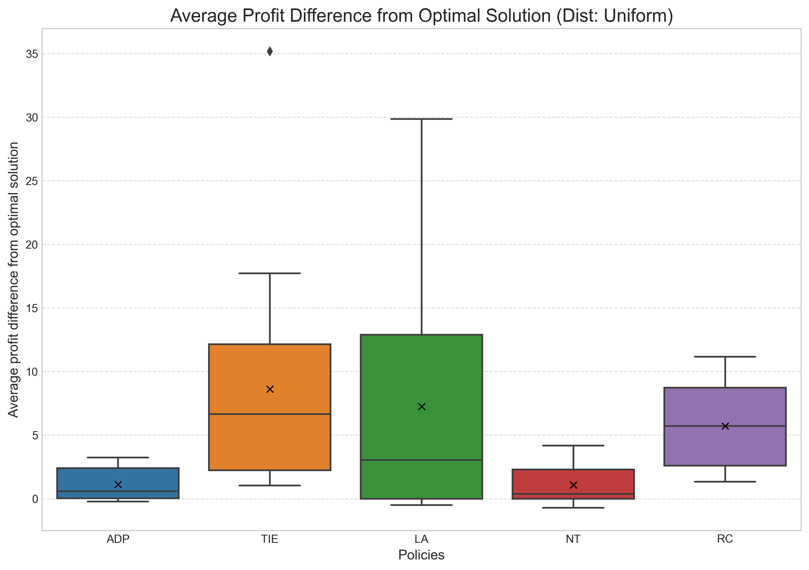

# Approximate Dynamic Programming for Lateral Transshipments with a Concave Cost Function

### **Ismail Abouelseoud**
### **Master's Thesis**

---

## Overview

This repository contains the code implementation for a Master's thesis that builds upon the research paper:
> “Approximate Dynamic Programming for Lateral Transshipment Problems in Multi‑Location Inventory Systems”  
> by Joern Meissner and Olga V. Senicheva

The project first reproduces the results of the original paper. The primary extension of this work is the integration of **non-linear, concave cost functions** (`_cc` scripts) into the policies. This enhancement changes the policy structure from convex linear programming to non-convex MILP; however, this change allows the model to account for **economies of scale** in transshipment, aligning it more closely with real-world logistics.

The codebase replicates the paper’s findings across five experimental setups: three for two-location systems and two for multi-location systems.

---

## Usage

Requirements

- **Python**: 3.10+ (developed on 3.13.5)
- **Dependencies**: numpy, scipy, matplotlib (see requirements.txt)

Install dependencies:

```bash
pip install -r requirements.txt
```

To run a simulation, use the `simulate.py` script with a specified test case ID.

```bash
python3 simulate.py --testcase_id {0,1,2,3,4} --force
````

### Options

  * `--N <int>`: Number of simulation runs (default: 1000). Runtime scales linearly with this value.
  * `--testcase_id <0–4>`: Selects one of five pre-defined test cases:
      * `0`: Multi-location system with varying locations (L) and transshipment costs.
      * `1`: Multi-location system with varying locations (L) and initial inventory.
      * `2`: Two-location system with Negative-Binomial demand.
      * `3`: Two-location system with Poisson demand.
      * `4`: Two-location system with Uniform demand.
  * `--force`: Forces all simulations to rerun, overwriting any existing results.
  * `--ncost`: Use the non-linear (piecewise) concave cost function to model economies of scale.

-----

## Collecting Results

To aggregate the results from simulation runs, use the `collect_data.py` script.

```bash
python3 collect_data.py --testcase_id {0,1,2,3,4}
```

**Note:** If the simulation was run with the non-linear cost function, you must also include the `--ncost` flag here.

The code create an csv file with the summery in the result file and create a boxplot figure for the testcase.


-----

## Implemented Policies

All policies are located in the `policies/` directory. Policies extended to use the concave cost function are denoted with a `_cc` suffix (e.g., `fadp_cc.py`).

  * **`dp.py`**: Exact dynamic programming, optimal for two-location systems (L=2).
  * **`dp_gen.py`**: Generalized DP for any number of locations. Matches `dp.py` when L=2.
  * **`fadp.py`**: Forward Adaptive Dynamic Programming (FADP) as described in the paper.
  * **`lap.py`**: Lookahead (LA) policy for L=2 and multi-location systems.
  * **`lpp.py`**: Real-time optimal policy, which serves as an upper bound for multi-location systems.
  * **`ntp.py`**: No-Transshipment Policy, where inventory remains at its original location.
  * **`rcp.py`**: RC Policy, which moves one unit at a time based on the current inventory state.
  * **`tiep.py`**: Lateral TIE Policy, a proactive heuristic that redistributes inventory when stock falls below expected demand.
  * **`_cc`**: A nonlinear cost function adds high complexity to all policies since the objective function is not convex in this case and requires the use of MILP.
-----

## Other Scripts

  * **`set_parameters.py`**: Generates the parameter sets for the five test cases.
  * **`simulate.py`**: The main script used to run simulations.
  * **`collect_data.py`**: The script for postprocessing the results and creating a summery.
-----

## Output Example

Results are saved as `.txt` files in the `results/` directory, formatted as `testcase_<id>_set_<set>.txt`. Each file contains the parameters and policy outcomes for that run.

### Sample Output

```
Finished Running Set 0 from test id 4 with params:
{'Distribution': 'Uniform', 'L': 2, 'T': 4, 'h': [8, 12], 'c': 1,
 'p': [40, 80], 'mu': [0.5, 0.5], 'rho': [[0, 29], [29, 0]], 'S': [3, 3], 'ij': [1, 1]}
Set 0/18, 1000 iterations. Average profit <OPT>: 95.88,
average profit <DPGen>: 95.88. Ratio: 1.0.
Elapsed time: 0.237 sec.
```

### Parameter Description

  * **`h`**: Holding costs per unit of leftover inventory at each location.
  * **`c`**: Transshipment cost factor per unit shipped per unit of distance.
  * **`p`**: Unit profits (revenue) for each unit sold at each location.
  * **`mu`**: Mean demand per period at each location.
  * **`rho`**: Distance matrix between locations.
  * **`S`**: Starting inventory levels at each location.
  * **`ij`**: Defines the parameter range for the Uniform demand distribution. In this case, demand is drawn from [0, i] and [0, j].

In this example, the exact DP (`OPT`) and the generalized DP (`DPGen`) both achieve an average profit of **95.88**. The ratio of **1.0** confirms that the generalized DP implementation correctly replicates the optimal two-location solution while being extensible to larger, multi-location problems.
